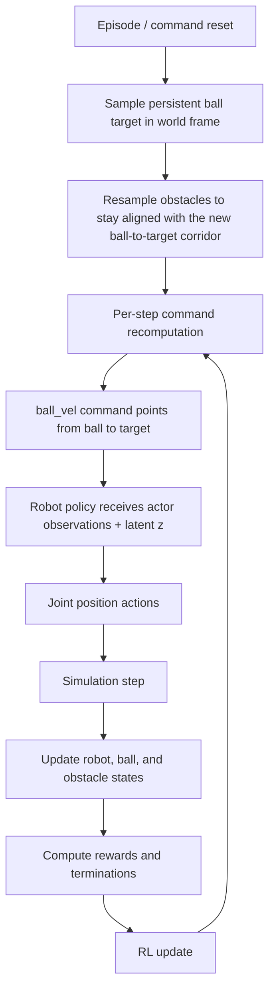
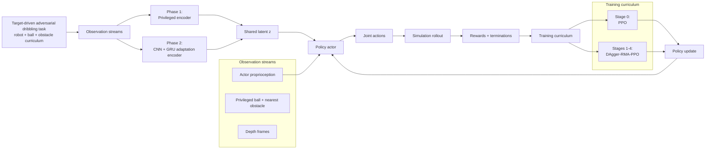
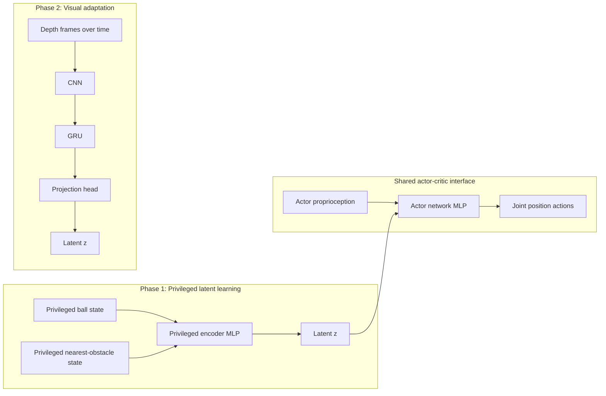
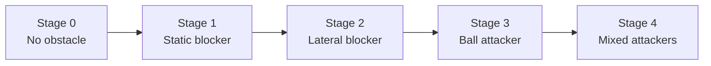
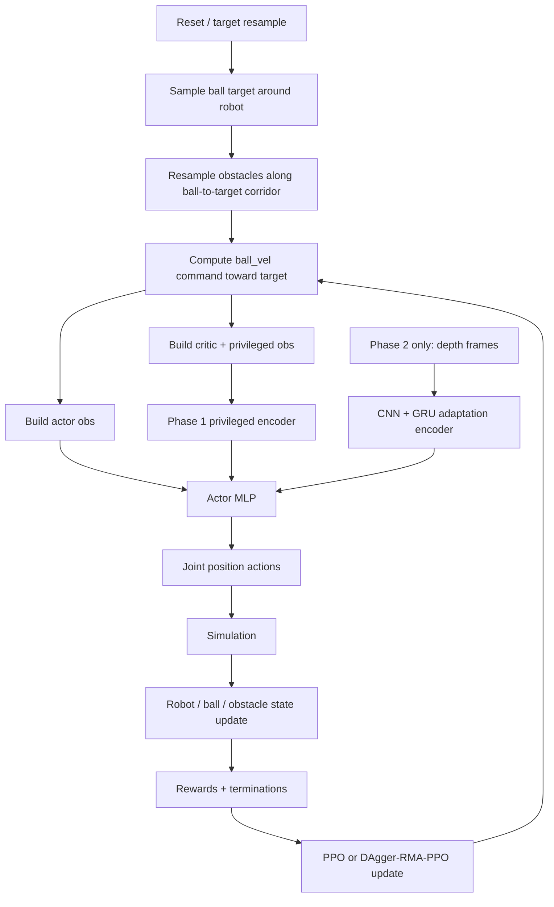

# Dribbling Pipeline Sketch

This document provides a compact sketch of the current dribbling pipeline in
this codebase, from task generation to training and deployment-oriented
inference.

It is meant as a bridge between the implementation and the paper figures:

- you can read it directly as documentation
- you can reuse the Mermaid blocks as a starting point for a paper figure
- you can simplify or redraw each block later in Excalidraw, draw.io, or
  another diagram tool

## 1. High-Level Pipeline



## 1.1 Paper-Ready High-Level Block Diagram

This is the most compact high-level diagram for the paper. It is intentionally
abstract: it explains the full training and inference pipeline without exposing
too many implementation details.



### Suggested interpretation for the paper figure

The figure should communicate four ideas:

- the task is target-driven and obstacle-aware
- the actor always uses the same interface: proprioception plus a latent `z`
- in Phase 1, `z` comes from a privileged encoder, while in Phase 2 it comes
  from a visual adaptation encoder based on CNN+GRU
- policy learning is staged: Stage 0 uses PPO, while obstacle stages use
  DAgger-regularized PPO

### Recommended caption text

You can use something close to the following as a starting caption:

> Overview of the adversarial dribbling pipeline. The task generates a
> target-driven ball command and an obstacle curriculum. The actor always
> receives proprioceptive observations together with a latent exteroceptive
> representation \(z\). In Phase 1, this latent is produced by a privileged
> encoder from ground-truth ball and nearest-obstacle state. In Phase 2, the
> same latent is predicted from depth observations through a CNN+GRU adaptation
> module. Policy training is stage-wise: Stage 0 is optimized with PPO to learn
> nominal dribbling, while Stages 1--4 use DAgger-regularized PPO to preserve
> the nominal behavior while acquiring obstacle avoidance.

### Recommended redraw for the final paper

For the final paper figure, I would simplify the Mermaid block into four
horizontal blocks:

1. `Task generation`
   target, ball command, obstacle curriculum
2. `Latent estimation`
   privileged encoder in Phase 1 or CNN+GRU encoder in Phase 2
3. `Control policy`
   actor takes proprioception + latent and outputs actions
4. `Training scheme`
   PPO at Stage 0, DAgger-RMA-PPO at Stages 1--4

That version is usually easier to read in a two-column paper than a full
training loop diagram.

## 2. Task-Side Environment Flow

### 2.1 Persistent target and target-driven command

The dribbling task is no longer driven by a free velocity command sampled
independently every few seconds. Instead, each environment carries a persistent
ball target in world coordinates.

At target resampling time:

- a target heading is sampled around the robot forward direction
- a target distance is sampled from `target_distance_range`
- a world-frame target position is created around the robot
- the obstacle command is also resampled for the same env ids, so the obstacle
  remains consistent with the new ball-to-target path

At every step:

```text
target_delta = target_position - ball_position
target_dir   = normalize(target_delta)
speed        = clip(speed_gain * ||target_delta||, v_min, v_max)
ball_vel_cmd = speed * target_dir
```

So the command always answers the same question:

`In which direction should the ball move now, if it wants to reach the current target?`

### 2.2 Obstacle spawning and obstacle-target coupling

For blocking stages, obstacles are not spawned arbitrarily around the robot.
They are placed along the current ball-to-target corridor.

For `static_blocker`, `lateral_blocker`, and `ball_attacker`, the command term
computes:

```text
seg      = target_xy - ball_xy
seg_len  = ||seg||
seg_dir  = normalize(seg)
seg_side = perpendicular(seg_dir)
```

and samples:

```text
obstacle_pos
  = ball_xy
  + forward_fraction * seg_len * seg_dir
  + lateral_offset * seg_side
```

with current defaults:

- `forward_fraction_range = (0.35, 0.75)`
- `lateral_offset_range = (-0.3, 0.3)`

This ensures that blockers are placed on a meaningful portion of the current
intended dribbling path.

### 2.3 Obstacle lifecycle

Obstacle logic runs every step:

- inactive obstacles are parked far away
- active obstacles are moved according to their behavior
- moving obstacles resample internal motion targets according to a timer
- blockers stay fixed unless the encounter ends or the target changes

Current obstacle behaviors:

- `none`
- `static_blocker`
- `lateral_blocker`
- `ball_attacker`
- `mixed_attackers`

In the mixed stage:

- obstacle 0 = `ball_attacker`
- obstacle 1 = `lateral_blocker`
- obstacle 2 = `distractor`

## 3. Observation and Encoder Structure

The code uses an asymmetric actor-critic plus an RMA-style latent.

### 3.1 Actor observations

The actor is proprioceptive. It receives:

- IMU angular velocity
- projected gravity
- joint position error
- joint velocity
- previous action
- gait phase command
- current `ball_vel` command expressed in body frame

So the actor does **not** directly consume raw obstacle state or raw ball state.

### 3.2 Critic observations

The critic receives:

- actor observations
- privileged ball state
- privileged obstacle state
- extra stabilizing / contact / terrain-related signals

This is a standard asymmetric actor-critic setup.

### 3.3 Privileged latent

The actor also receives a latent `z` produced by the dribbling RMA term.

That latent summarizes exteroceptive task information.

In this task, the privileged inputs are:

- ball position and velocity
- nearest active obstacle position and velocity in body frame

## 4. Network / RMA Pipeline

The policy interface stays fixed across phases:

- actor input = proprioception + latent `z`
- critic input = asymmetric privileged critic observation

What changes across phases is how `z` is produced.



### 4.1 Phase 1

In Phase 1:

- the latent is generated by a privileged encoder
- the privileged encoder is an MLP
- PPO-style policy learning is performed using this privileged latent

This phase learns the control policy itself.

### 4.2 Phase 2

In Phase 2:

- the actor is kept fixed
- the privileged encoder is replaced by a visual adaptation encoder
- the adaptation encoder processes depth images through a CNN + GRU
- the output is projected into the same latent space used in Phase 1

Phase 2 is trained with:

- latent alignment loss against the Phase-1 privileged latent
- auxiliary heads for ball state
- auxiliary heads for nearest-obstacle state

So Phase 2 teaches a visual encoder to reproduce the same task-relevant latent
that was previously available from privileged state.

## 5. Training Curriculum and Optimization Procedure

Training is organized along two axes:

- `phase`: how the latent is produced
- `stage`: obstacle difficulty during policy learning

This distinction is important:

- `phase` belongs to the RMA pipeline
- `stage` belongs to the obstacle curriculum inside policy training

### 5.1 Stage-wise obstacle curriculum

Current Phase-1 obstacle stages:



Interpretation:

- `Stage 0`: learn nominal dribbling and locomotion
- `Stage 1`: learn to bypass a fixed blocker on the ball-to-target corridor
- `Stage 2`: handle a moving lateral obstacle
- `Stage 3`: handle an obstacle approaching the ball
- `Stage 4`: handle a multi-obstacle scene

### 5.2 Optimization strategy

The optimization strategy depends on the stage.

#### Phase 1, Stage 0

- algorithm: `RmaPPO`
- objective: standard PPO-style RL with privileged latent

Purpose:

- acquire a nominal dribbling controller without obstacle perturbations

#### Phase 1, Stages 1--4

- algorithm: `DaggerRmaPPO`
- initialization: from the Stage-0 checkpoint
- teacher: Stage-0 policy checkpoint
- student: obstacle-stage policy

The student is trained with:

- PPO objective
- imitation loss toward the Stage-0 teacher

Why:

- preserve the nominal gait and ball-handling behavior learned in Stage 0
- reduce catastrophic forgetting when obstacles are introduced
- still allow deviations from the teacher when obstacle avoidance is needed

#### Phase 2

- actor: frozen
- adaptation encoder: trainable
- supervision: privileged latent + auxiliary ball/obstacle heads

Purpose:

- replace privileged exteroceptive information with a visual latent

## 6. Reward-Side Pipeline

The current task shaping can be understood as four layers.

### 6.1 Ball-motion tracking

These rewards try to make the ball follow the target-induced command:

- `ball_vel_tracking`
- `ball_vel_norm`
- `ball_vel_angle`

They encourage:

- correct direction
- correct speed
- correct full velocity vector

### 6.2 Robot-ball geometry

These rewards maintain ball control:

- `robot_ball_distance`
- `robot_ball_yaw`
- `robot_ball_approach_vel`

They encourage:

- keeping the ball close
- keeping it in front of the robot
- moving the base so the robot can recover or maintain possession

### 6.3 Obstacle-aware shaping

These rewards are obstacle-specific:

- `robot_obstacle_collision`
- `ball_obstacle_collision`
- `obstacle_direction`

Interpretation:

- `robot_obstacle_collision`: keep the robot body safe
- `ball_obstacle_collision`: keep the ball from colliding with obstacles
- `obstacle_direction`: penalize sending the ball through an obstacle that lies
  on the current ball-to-target corridor

### 6.4 Anti-stall progress

The `ball_target_progress` term rewards positive ball velocity toward the
current target.

However, it is gated:

- it fades out when the target is already very close
- it also fades out when the target itself is too close to the nearest obstacle

This is important because it prevents the policy from being forced to keep
pushing toward a target that is effectively already reached or locally blocked.

## 7. Termination Logic

Episodes may terminate because:

- timeout
- robot falls over
- the ball is captured by an obstacle
- the ball is lost too far from the robot

Also, the ball target itself is not a hard environment termination by default:

- when the ball reaches the current target, a new target is resampled
- obstacle resampling follows that target reset, keeping the corridor consistent

## 8. End-to-End Summary



## 9. Suggested Figure Split For The Paper

If you later convert this into paper figures, the cleanest split is:

### Figure A: Task and training pipeline

Include:

- persistent target generation
- corridor-coupled obstacle spawning
- obstacle stage curriculum
- PPO at Stage 0
- DAgger-regularized PPO at Stages 1--4
- Phase 2 adaptation training

### Figure B: Network architecture

Include:

- actor proprioceptive input
- privileged encoder MLP in Phase 1
- CNN + GRU adaptation encoder in Phase 2
- shared latent interface `z`
- actor network
- critic with privileged information

## 10. File Map

Useful implementation anchors:

- target-driven command:
  [src/colosseum/tasks/dribbling/mdp/ball_velocity_command.py](/home/valeriospagnoli/SPQR/colosseum/src/colosseum/tasks/dribbling/mdp/ball_velocity_command.py:1)
- obstacle runtime logic:
  [src/colosseum/tasks/dribbling/mdp/obstacle_commands.py](/home/valeriospagnoli/SPQR/colosseum/src/colosseum/tasks/dribbling/mdp/obstacle_commands.py:1)
- obstacle curriculum:
  [src/colosseum/tasks/dribbling/mdp/curriculum.py](/home/valeriospagnoli/SPQR/colosseum/src/colosseum/tasks/dribbling/mdp/curriculum.py:1)
- task config:
  [src/colosseum/tasks/dribbling/config/t1_23dof/cact_cfg.py](/home/valeriospagnoli/SPQR/colosseum/src/colosseum/tasks/dribbling/config/t1_23dof/cact_cfg.py:1)
- rewards:
  [src/colosseum/tasks/dribbling/config/t1_23dof/reward_cfg.py](/home/valeriospagnoli/SPQR/colosseum/src/colosseum/tasks/dribbling/config/t1_23dof/reward_cfg.py:1)
  [src/colosseum/tasks/dribbling/mdp/rewards.py](/home/valeriospagnoli/SPQR/colosseum/src/colosseum/tasks/dribbling/mdp/rewards.py:1)
- observations:
  [src/colosseum/tasks/dribbling/config/t1_23dof/observation_cfg.py](/home/valeriospagnoli/SPQR/colosseum/src/colosseum/tasks/dribbling/config/t1_23dof/observation_cfg.py:1)
- RMA term:
  [src/colosseum/tasks/dribbling/mdp/rma_terms.py](/home/valeriospagnoli/SPQR/colosseum/src/colosseum/tasks/dribbling/mdp/rma_terms.py:1)
- algorithm configs:
  [src/colosseum/tasks/dribbling/config/t1_23dof/algo_cfg.py](/home/valeriospagnoli/SPQR/colosseum/src/colosseum/tasks/dribbling/config/t1_23dof/algo_cfg.py:1)
- usage examples:
  [README.md](/home/valeriospagnoli/SPQR/colosseum/README.md:1)
